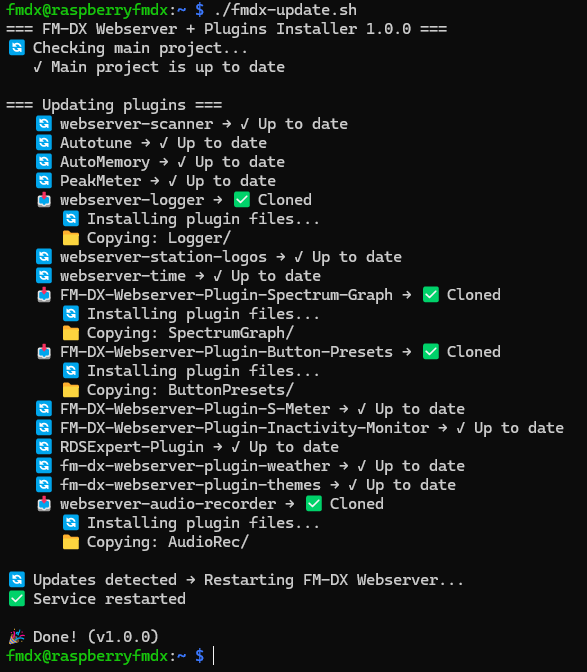

# fm-dx-wewbserver plugins installer and updater

> v1.0.0 2025-05-06 Initial release
> Thanks to @grok for vibe coding🤗😇

This script installs and updates [fm-dx-wewbserver](https://github.com/noobishsvk/fm-dx-webserver) and 15 plugins. You can easily add other plugins from [Plugin list](https://github.com/NoobishSVK/fm-dx-webserver/wiki/Plugin-List) as github links to `PLUGINS=` section. 

Set preferred language (en, de, fr, ru) in `LANGUAGE=` variable.

## fm-dx-webserver and plugins Installation

If you have no **fm-dx-webserver** installed on your Linux system, please make sure you install requirements described in [Linux manual](https://github.com/NoobishSVK/fm-dx-webserver/wiki/Linux-Installation#installation-of-fm-dx-webserver):

```bash
sudo apt install -y ffmpeg nodejs npm
mkdir -p ~/fm-dx-webserver  # project installation folder
wget https://github.com/ykmn/fm-dx-updater/raw/refs/heads/main/fmdx-update.sh
sudo chmod +x ~/fmdx-updater.sh
```

Run script `~/fmdx-updater.sh`. It will install **fm-dx-webserver** if it was not found in ~/fm-dx-webserver, and install plugins. You may get `systemctl restart` error after initial installation, because you have to create and enable service file `/etc/systemd/system/fm-dx-webserver.service` after installation by yourself according to manual:

```bash
[Unit]
Description=FM-DX Webserver
After=network-online.target

[Service]
ExecStart=npm run webserver
WorkingDirectory=/home/fmdx/fm-dx-webserver
User=fmdx
Restart=always

[Install]
WantedBy=multi-user.target

```

## fm-dx-webserver and plugins Update

Next run will check for update. Script will `git pull` all repos and copy new files for main project folder if there are any changes.

Service *fm-dx-webserver* will be restarted by script.

